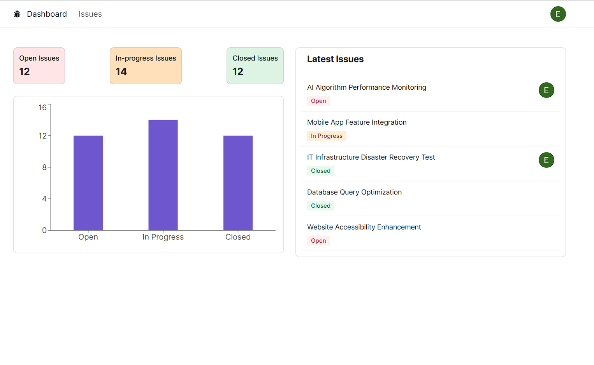
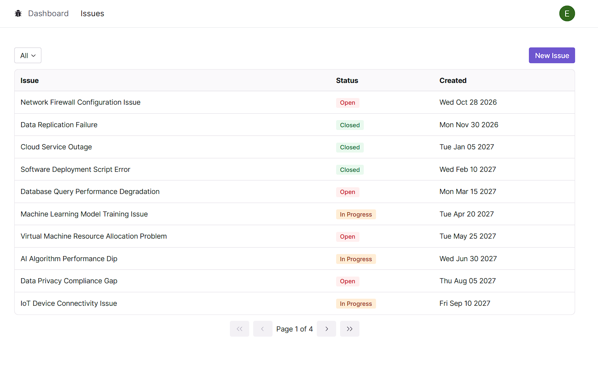

# Issue Tracker Dev

## Overview

This is a Next.js project for managing issues.

## Installation

1. Clone the repository: `https://github.com/EzzElddin-AbdAllah/issue-tracker`

2. Install the project dependencies: `npm install`

3. Create a `.env` file and configure the following environment variables:

   - DATABASE_URL=<your_database_url>
   - NEXTAUTH_URL=<your_nextauth_url>
   - NEXTAUTH_SECRET=<your_nextauth_secret>
   - GOOGLE_CLIENT_ID=<your_google_client_id>
   - GOOGLE_CLIENT_SECRET=<your_google_client_secret>

4. Run the development server: `npm run dev`

The app should now be running at [http://localhost:3000](http://localhost:3000).

## Usage Examples

## Technologies Used

- Next.js
- TypeScript
- React
- React Hook Form
- NextAuth.js
- Prisma
- Axios
- Tailwind CSS
- Radxi UI
- Zod

## Deployment

Issue Tracker is deployed on [issue-tracker-ezz.vercel.app](https://issue-tracker-ezz.vercel.app). We used Vercel for seamless deployment.
